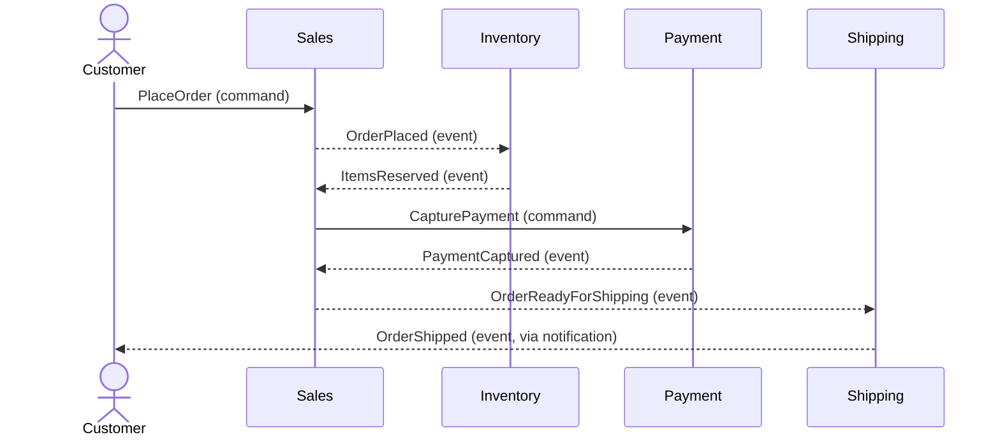

# Event Storming — descobrir o domínio rápido

Fontes: `[Distilled cap.7]`, `[EventStorming]` (eventstorming.com, Brandolini), `[DDD Crew]`, discussões contemporâneas (ddd.academy, eventstormingjournal.com).

Criado por Alberto Brandolini. Três sabores, cada um com objetivo distinto. O time escolhe o sabor pela pergunta que quer responder.

---

## Por que funciona — tátil, rápido, barato

`[Distilled cap.7]`

Event Storming é desenhado pra **reduzir custo de erro**. Sticky note físico custa centavos; sticky digital (Miro/FigJam) custa zero. Errou? Amassa, joga fora, refaz. Isso muda a dinâmica: em vez de modelar no abstrato e descobrir o erro na produção, o erro vira visível em minutos.

Três propriedades que sustentam o método:

1. **Tátil** — todo mundo escreve, ninguém é só ouvinte. Domain expert, dev, PM, ops — iguais em volume de contribuição.
2. **Rápido** — de 2 horas a 2 dias, não 2 semanas. Ciclo curto força priorização; deixa o conceito emergir, não projeta do zero.
3. **Barato** — o material é quase grátis. O caro é a hora dos participantes, e exatamente por isso a técnica respeita o tempo deles com timebox forte.

O resultado é conhecimento **distribuído**: ninguém sai da sala achando que "o outro time sabe"; todos viram co-autores do modelo.

Integra bem com **scenarios** (ver `scenarios.md`) — cenários concretos antes do storming trazem vocabulário real; depois do storming validam o modelo descoberto.

---

## Os três sabores

| Sabor | Pergunta que responde | Escala | Duração típica |
|-------|-----------------------|--------|----------------|
| **Big Picture** | Como este negócio funciona? Onde estão os bounded contexts? | Empresa/sistema inteiro | 2-4h |
| **Process Modelling** | Como este processo específico acontece? Onde estão gargalos, decisões? | Um processo (pedido, onboarding...) | 2-4h |
| **Design Level** | Como esse processo vira software? | Um bounded context | 4-8h, múltiplas sessões |

Para um ERP novo: **Big Picture primeiro** (descobrir contextos), depois **Design Level por contexto** (cada contexto com seu time e design próprio).

---

## Convenção de cores (stickies)

A convenção padrão (stickies físicos ou digitais no Miro/Mural):

| Cor | Elemento | Escopo |
|-----|----------|--------|
| Laranja | **Domain Event** (`OrderConfirmed`, `PaymentReceived`) — verbo no passado | Todos os sabores |
| Azul claro | **Command** (`ConfirmOrder`, `ProcessPayment`) — imperativo | Process, Design |
| Amarelo | **Actor / User / Role** | Todos |
| Rosa | **External System** | Big Picture, Process |
| Lilás/Roxo | **Policy** (regra reativa: "whenever X, then Y") | Process, Design |
| Verde | **Read Model / View** | Design |
| Vermelho | **Hotspot** (problema, dúvida, risco) | Todos — sticker vermelho em cima |
| Amarelo pálido (grande) | **Aggregate** | Design |
| Linha / marker | **Bounded Context / Swimlane** | Big Picture, Design |

Fonte: `[EventStorming]`, `[Distilled cap.7]`, Brandolini EventStorming Masterclass.

---

## Big Picture Event Storming — passo a passo

**Objetivo:** ter um mapa do negócio inteiro em 2-4h para descobrir bounded contexts e eventos críticos.

**Participantes:** 5-15 pessoas. Mix crítico: domain experts + devs + product + ops/suporte. **Sem espectadores.** Sem PowerPoint.

**Setup físico:** parede 8-10m × 1.5m, papel kraft, stickies muitos.
**Setup remoto:** board infinito (Miro, Mural, Qlerify, FigJam). `[prática pós-2020]`

**Passos:**

1. **Chaos Storming (30-45min)** — cada participante escreve domain events (stickies laranja, passado) que conhece e cola na parede em aproximação temporal. Sem filtro. Objetivo: quantidade. Esperado: 50-200 stickies.

2. **Enforced timeline (30-45min)** — reorganizar em linha temporal da esquerda pra direita. Eventos simultâneos empilham verticalmente. Facilitador faz perguntas para destravar ambiguidade.

3. **Hotspots (15-20min)** — marque com vermelho tudo que é dúvida, risco, controvérsia. Discuta depois, não agora.

4. **Pivotal Events** — identifique eventos que mudam radicalmente o "estado do mundo" (`OrderPlaced`, `PaymentSettled`, `ShipmentDispatched`). Eles tendem a marcar fronteiras de contexto.

5. **Swimlanes / Bounded Context candidates** — agrupe events com marcadores pretos/linhas. Regiões com linguagem própria, actors distintos, cadência temporal diferente → candidato a bounded context.

6. **Systems & Actors (final)** — adicione rosa (sistemas externos) e amarelo (actors) só onde ajuda na clareza.

**Entregáveis:**
- Foto/export do board
- Lista de pivotal events
- Lista de candidatos a bounded context
- Lista de hotspots (backlog de descoberta)

---

## Design Level Event Storming — passo a passo

**Objetivo:** transformar um processo/contexto em design de software executável. Saída dá insumo direto para código.

**Participantes:** 3-8 pessoas do time do contexto.

**Passos:**

1. **Events + Commands** — para cada evento (laranja), quem o causa? Comando (azul) à esquerda. Quem disparou? Actor (amarelo).

2. **Aggregates** — agrupe (Command → Aggregate → Event). Aggregate (amarelo pálido grande) é a "coisa" que recebe command, enforce invariantes, emite event.

3. **Policies** — "whenever Event X, then Command Y" — políticas (roxo) conectando eventos a novos comandos. É aqui que nasce eventual consistency entre agregados.

4. **Read Models** — o que o usuário precisa ver antes de decidir comandar? Verde, posicionado perto dos commands.

5. **External Systems / Integration** — onde o contexto conversa com outros contextos/sistemas. Aqui nasce a discussão de pattern de context map (ACL, OHS, etc.).

6. **Hotspots remanescentes** — o que ainda não sabemos resolver? Backlog de descoberta.

**Saída mapeia 1:1 para código:**
- Command → Application Service method
- Aggregate → Aggregate class
- Event → Domain Event
- Policy → Domain Event handler que emite novo command
- Read Model → projeção CQRS (se CQRS aplicável)

---

## Domain Message Flow Modelling

`[Distilled cap.4]` `[DDD Crew — domain-message-flow-modelling]` `[prática pós-2020]`

Depois do Big Picture, antes do Bounded Context Canvas. Técnica intermediária que transforma a timeline de eventos num **diagrama de mensagens cross-context**: quem envia o quê pra quem, em que ordem.

### Objetivo

Tornar explícitas as **interações entre candidatos a Bounded Context** antes de decidir patterns de integração (ACL, OHS, etc. — ver `context-mapping.md`). Sem esse passo, o Context Map da fase 4 vira adivinhação.

### Quando fazer

- Imediatamente após o Big Picture Event Storming, quando há 3+ candidatos a BC
- Antes de preencher Bounded Context Canvas (alimenta Inbound/Outbound Communication)
- Em retrospectiva: um fluxo específico de produção ficou confuso? Desenhe o message flow real

### Notação

Formato sequence-diagram (Mermaid, PlantUML, ou sticky notes em swimlanes):

- **Eixo horizontal:** actors (humanos, BCs candidatos, sistemas externos) como swimlanes
- **Eixo vertical:** tempo (de cima pra baixo)
- **Setas:** mensagens trocadas
  - Seta cheia = **Command** (pedido síncrono ou assíncrono com expectativa de resposta)
  - Seta tracejada = **Domain Event** (publicação; quem escuta decide)
  - Seta bidirecional = **Query** (menos comum cross-BC; sinal de reavaliar)
- **Rótulo:** nome da mensagem em Ubiquitous Language

### Template mínimo (Mermaid)

### Como rodar (90-120 min)

**Participantes:** 3-8 — reduzido face ao Big Picture; foco em quem realmente entende de integração.

**Passos:**

1. **Escolha 2-3 cenários críticos** (15 min) — happy path + 1-2 exceções ("pagamento falha", "item fora de estoque"). Não tente desenhar tudo.

2. **Identifique actors/BCs** (10 min) — swimlanes no board. Usuário humano, cada BC candidato, sistemas externos relevantes.

3. **Desenhe o happy path** (30 min) — mensagem por mensagem, top-down. Force a distinção Command vs Event em cada seta. Se alguém diz "ele chama X", pergunte: é command (pedido direto) ou reação a evento publicado?

4. **Desenhe cenários de exceção** (20-30 min) — o que acontece quando Inventory não tem estoque? Payment falha? A sequência de compensação aparece aqui — input pra desenhar Saga depois.

5. **Identifique acoplamentos indesejados** (15 min) — setas cheias cross-BC (Commands cruzando fronteira) são sinal de acoplamento síncrono; questione se deveria ser evento.

6. **Timeouts e SLAs** (10 min) — anote em mensagens-chave qual é o SLA esperado (ms, s, minutos) — alimenta decisão de síncrono vs assíncrono na fase de Context Map.

### Saída

- Diagrama por cenário (happy + exceções), commitado no repo de arquitetura
- Lista de mensagens Commands/Events consolidada (input pro domain-events-catalog)
- Hotspots: setas controversas ou ambíguas → backlog de refinamento
- Acoplamentos síncronos a reavaliar na fase de Context Map

### Integração com outras fases

- **Alimenta Bounded Context Canvas** — seções Inbound/Outbound saem direto daqui (ver `bounded-context-canvas.md`)
- **Alimenta Context Map** — toda seta cross-BC vira uma aresta com pattern a escolher (ver `context-mapping.md`)
- **Alimenta Design Level Storming** — commands e events vão pra domain dentro de cada BC

### Armadilhas

- **Desenhar tudo de uma vez** — flow explode em 200 setas, ninguém acompanha. Limite-se a 2-3 cenários por sessão.
- **Misturar síncrono/assíncrono sem marcar** — todo command cross-BC deve deixar claro: síncrono bloqueante? fire-and-forget? assíncrono com callback? Diagrama ambíguo = decisão adiada.
- **Pular exceções** — happy path sem compensação não mostra a complexidade real.
- **Detalhar campos do payload** — isso é do design level; aqui o nome da mensagem basta.

---

## Formato remoto — realidades pós-2020

`[prática pós-2020]`

**O que funciona:**
- Board infinito (Miro/Mural/FigJam) com templates de Brandolini / DDD Crew
- Sessões mais curtas, mais frequentes (90min cada, 2-3 sessões na semana) em vez de workshop único de dia inteiro
- Facilitador separado do participante — carga cognitiva remota é maior
- Pre-workshop: glossário inicial e 1-pager de contexto
- Breakout rooms para paralelismo em grupos de 3-4

**Armadilhas:**
- "Board virou cemitério de stickies" — sem enforcing de timeline, perde poder
- Participantes com câmera off — não funciona, eventually storming é conversa
- Tentar capturar tudo digitalmente em tempo real — descarrega facilitador; use screenshot e transcrição depois
- Microfones com eco ou áudio ruim — reduz qualidade do output drasticamente

---

## Quando NÃO fazer event storming

- Domínio trivial (CRUD claro, regras óbvias) — não compensa o custo
- Time não tem domain expert disponível — storming sem expert é teatro
- Projeto já tem modelo maduro e testado em produção há tempo — faça refinements pontuais, não big-picture reset

---

## Integração com outras técnicas `[DDD Crew Starter Process]`

Sequência típica pra projeto novo (ERP ex.):
1. Big Picture Event Storming
2. Domain Message Flow Modelling (quem envia/recebe o quê)
3. Bounded Context Canvas (detalha cada candidato: propósito, domain roles, ubiquitous language, decisões)
4. Context Map (patterns entre contextos)
5. Design Level Event Storming por contexto (em paralelo)
6. ADRs (Architecture Decision Records) capturando decisões
7. Implementação incremental (bubble context ou módulo novo)

---

## Recursos canônicos

- `eventstorming.com` — site original de Brandolini
- `github.com/ddd-crew/big-picture-event-storming`
- `github.com/ddd-crew/bounded-context-canvas`
- `ddd.academy/event-storming-master-class` — curso oficial Brandolini
- `eventstormingjournal.com` — casos práticos
- Livro: Alberto Brandolini, *Introducing EventStorming* (em progresso permanente, leanpub)
