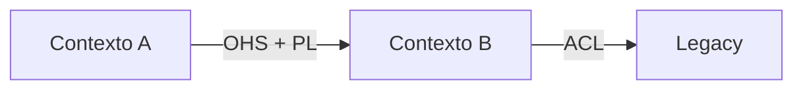

# Template — Spec de Conversão para DDD

Este é o **formato de saída** do Modo 3 (Spec) da skill. A skill preenche esse template com base em strategic design, análise do código atual e entrevistas com o usuário.

Produza markdown. Use referências cruzadas a `references/*.md` quando aplicável (a spec final é autocontida, mas pode apontar pra docs vivos).

---

## Template

```markdown
# Spec de Conversão DDD — <nome do projeto/sistema>

Versão: <N>
Data: <YYYY-MM-DD>
Autor: <responsável>
Status: <rascunho / em revisão / aprovado>

## 1. Contexto e motivação

### 1.1 O que existe hoje
<descrição honesta do estado atual — stack, organização do código, problemas dominantes, complexidade de negócio, tamanho do time>

### 1.2 Por que converter para DDD
<problema concreto que a conversão endereça — não "é moderno", mas "o que dói hoje que DDD resolve">

### 1.3 Critérios de sucesso
<bullets mensuráveis: "reduzir MTTR de bugs em X%", "entregar feature Y em Z semanas em vez de 2×Z", "auditoria regulatória da área W passa">

### 1.4 Fora de escopo
<o que essa conversão explicitamente NÃO fará>

## 2. Domain Vision Statement

<1 parágrafo: o que este sistema faz de único que justifica investimento em modelagem profunda>

## 3. Subdomains

| Subdomain | Tipo | Por que é desse tipo | Estratégia |
|-----------|------|----------------------|------------|
| <Nome> | Core | <justificativa> | Modelar profundamente, time sênior |
| <Nome> | Supporting | <justificativa> | Modelo limpo, time médio |
| <Nome> | Generic | <justificativa> | COTS / biblioteca / outsource |

## 4. Bounded Contexts propostos

### 4.1 <Contexto A>
- **Propósito** (1-2 frases)
- **Ubiquitous Language (amostra):** <termos-chave + definição curta>
- **Responsabilidades**: <bullets>
- **Fora do escopo** (o que NÃO é responsabilidade desse contexto): <bullets>
- **Owner sugerido**: <time/squad>
- **Mapeamento ao legacy**: <qual pedaço do sistema atual vira este contexto>

### 4.2 <Contexto B>
<mesmo template>

...

## 5. Context Map

<diagrama mermaid ou ASCII — contextos + pattern de integração entre cada par relevante>



**Relações:**

| De | Para | Pattern | Justificativa |
|----|------|---------|---------------|
| A | B | OHS + PL | <por quê> |
| B | Legacy | ACL | <por quê> |

## 6. Arquitetura alvo

**Estilo:** <modular monolith / hexagonal / microservices / híbrido>

**Justificativa:** <por que este estilo dado o time, escala, complexidade atual — ver `architecture-styles.md`>

**Estrutura de módulos (se modular monolith):**

```
<projeto>/
├── modules/
│   ├── <contexto-a>/
│   │   ├── api/             # porta pública
│   │   ├── application/     # use cases, transação
│   │   ├── domain/          # aggregates, VOs, events
│   │   └── infrastructure/  # ORM, adapters, messaging
│   ├── <contexto-b>/
│   └── <contexto-c>/
├── shared-kernel/           # só se realmente compartilhado
└── composition/             # bootstrap, DI, config
```

**Comunicação entre módulos:** <síncrono via API pública / Domain Events assíncronos / misto>

**Persistência:** <schema lógico por módulo; mesmo servidor ou separado; tecnologias>

**Mensageria (se aplicável):** <broker, padrões, outbox>

## 7. Modelagem por contexto (tática)

Para cada contexto, elabore:

### 7.1 <Contexto A>

#### Aggregates
| Aggregate | Root | Invariantes | Eventos emitidos |
|-----------|------|-------------|------------------|
| <Nome> | <EntityRoot> | <lista curta> | <eventos que emite> |

#### Value Objects
<lista com 1-linha por VO explicando o que encapsula>

#### Application Services (use cases)
<lista de comandos/queries)>

#### Integração com outros contextos
<o que consome / produz, via qual port>

### 7.2 <Contexto B>
<mesmo formato>

## 8. Estratégia de migração

**Padrão escolhido:** <strangler fig / bubble context / hybrid>

**Sequência faseada:**

| Fase | Escopo | Duração | Entregáveis | Risco | Mitigação |
|------|--------|---------|-------------|-------|-----------|
| 0 | Arqueologia + strategic design confirmado | 2-4 semanas | Context map validado, ADRs | Baixo | — |
| 1 | <contexto core mais doloroso> como bubble | 1 quarter | Contexto em prod, ACL validada | Médio | Feature flag + rollback |
| 2 | <próximo contexto> + dual-write de dados | 1 quarter | ... | ... | ... |
| 3 | Cutover / strangulação | 2 meses | Legacy reduzido a <X>% | Alto | Monitoria paridade, kill switch |
| 4 | Decommission | 1 mês | Legacy aposentado | Médio | Dados arquivados, docs |

**Checkpoint por fase:** critérios objetivos de "pronto pra próxima".

## 9. Decisões arquiteturais (ADRs)

Lista de decisões-chave que precisam de ADR independente:

- ADR-001: <título> (status, data)
- ADR-002: ...

## 10. Métricas de acompanhamento

- <métrica 1>: <target>
- Time-to-feature em contexto migrado: <antes / target>
- MTTR de bugs na área migrada: <antes / target>
- % tráfego no modelo novo: <por fase>
- Cobertura de testes em domain layer: target ≥ X%

## 11. Riscos e mitigações

| Risco | Probabilidade | Impacto | Mitigação |
|-------|---------------|---------|-----------|
| Escopo se expandir | Alta | Alto | Quarter reviews, caps explícitos |
| Time sem experiência DDD | Média | Alto | Pair com sênior, pairing/mobbing, workshops |
| Dados inconsistentes na migração | Média | Alto | CDC + reconciliação + dual-write validado |
| Resistência do time | Média | Médio | Envolvimento desde arqueologia, sem top-down |

## 12. Próximos passos imediatos

- [ ] <ação executável na próxima sprint>
- [ ] <outra>
- [ ] <outra>

## Apêndices

### A. Glossário (ubiquitous language consolidada)
<termos + definição — evolui com o projeto>

### B. Decisões adiadas
<o que decidimos NÃO decidir agora + quando revisar>

### C. Fontes consultadas
<livros, artigos, conversas com experts>
```

---

## Template enxuto — 1 página

Use quando o escopo é pequeno (1-2 bounded contexts, time pequeno, poucas integrações), ou quando a spec completa seria overkill pra decisão inicial. Serve de artefato leve pra alinhamento e pode expandir pra spec completa depois.

```markdown
# Spec DDD enxuta — <projeto>

Versão: <N> · Data: <YYYY-MM-DD> · Status: <rascunho/aprovado>

## Problema e objetivo
<3-5 frases: o que dói hoje, o que esperamos depois da conversão>

## Domain Vision (1 frase)
<o que o sistema faz de único>

## Bounded Contexts
| Contexto | Tipo | Responsabilidade (1 frase) | Owner |
|----------|------|----------------------------|-------|
| <A>      | Core/Supp/Gen | ... | squad X |
| <B>      | ... | ... | ... |

## Integração (Context Map resumido)
- `A → B`: <pattern>. <1-linha justificativa>
- `B → Legacy`: ACL. <motivo>

## Arquitetura
<modular monolith / hexagonal / outra> + 1 parágrafo justificando.

## Modelagem tática (só o contexto principal)
- **Aggregates:** `<Nome>` (root `<Entity>`, invariantes: ...)
- **VOs notáveis:** `<Nome>` — <o que encapsula>
- **Domain Events:** `<NomeEvent>` — <trigger>, quem consome
- **Application Services principais:** `<Command>` → efeito

## Migração — 3-5 passos
1. <primeira fatia executável em 1 sprint>
2. ...
3. ...

## Riscos top 3
- <risco> → <mitigação>
- ...

## Próximos passos
- [ ] <ação concreta da próxima sprint>
- [ ] <outra>
```

**Quando usar enxuta vs completa:**

| Situação | Template |
|----------|----------|
| 1 bounded context, ≤3 devs, prova de conceito | Enxuta |
| ERP com múltiplos módulos, time ≥5, compliance | Completa |
| Decisão "vale DDD aqui?" | Enxuta primeiro, expande se aprovado |
| Documentação pra stakeholders executivos | Enxuta |
| Referência pro time durante meses | Completa |

A enxuta cabe em 1 tela e deve ser lida em < 3 minutos. Se crescer mais, migre pro template completo.

---

## Instruções para a skill preencher o template

1. **Arqueologia primeiro** — não preencher chutes. Use event storming retroativo, leitura do código, entrevistas. Se faltar informação, marque `<a confirmar em entrevista com X>`.

2. **Contextos em ordem de valor** — começar pela seção 4 pelo contexto que é core+doloroso. Primeiro listado = primeira fase na seção 8.

3. **Seção 8 realista** — prazos que o time aceita. Se não souber, dê intervalo (`6-10 semanas`) e liste premissas.

4. **Anexar visual** — mermaid no context map; imagens de event storming como apêndice ou link.

5. **Versionamento** — a spec evolui. Guarde versões (`v0.1 rascunho`, `v1.0 aprovada`, `v1.1 revisão pós-fase-1`).

6. **Tamanho alvo** — 10-25 páginas. Spec gigante ninguém lê. Se crescer, extrair apêndices.

7. **Usar fan-out pra gerar** — quando o ERP tem vários módulos, spawne um subagente por módulo candidato pra preencher as subseções do 4 e 7 em paralelo, depois consolide.
